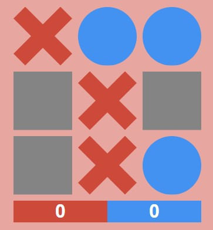

# Tic Tac Toe 📝

A Basic Tic Tac Toe game with Css Animations and Score [Tic tac Toe](https://telacreisteWe).

# Screenshot



# Tools and technologies
* [react](https://es.reactjs.org/) - Framework
* [CSS](https://styled-components.com/) for Animations and design
* [classnames](https://github.com/JedWatson/classnames#readme) - add classes to divs dynamically

# Deployment

[GitHub Pages]()

# To run this app
1. Clone this repo
2. Run ```npm install```
3. Run ```npm start```

# Credits
accesibleprogramacion:
Youtube Chanel: [accesibleprogramacion](https://www.youtube.com/channel/UCCsSBV1Jzk_ZtfPKKddNXgA) 
GitHub: [accesibleprogramacion](https://github.com/accesibleprogramacion/ta-te-ti) 